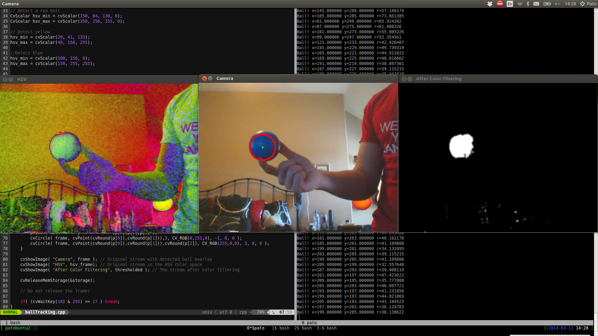

Autonomous Intelligent Robotics Research
==========================

Work in progress for Autonomous Intelligent Robotics Research Stream

CrazyFlie Python Controller
----

`controller.py` - crazyflie controller development

`key.py` - keyboard input development

Ball Detection
-----

`cpp/ballTracking.cpp` - C++ implementation of Hough Circle Transform

Team
----

Patricio Lankenau

Jonathan Christian
